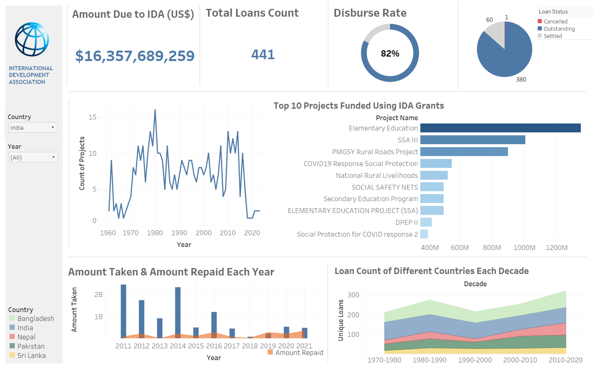

# Comprehensive Data Analysis and Visualization of IDA Loans Granted to India

## Project Overview
This project leverages MySQL and Tableau to perform a comprehensive data analysis and visualization of IDA loans granted to India. Utilizing advanced SQL queries, I extracted and transformed data from over 20,000 data points and 30 columns to create insightful visualizations that highlight key trends and statistics.

## Technologies Used

## Dataset
The dataset used in this project is sourced from the World Bank and contains historical data on IDA loans and credits. You can find more details about the dataset [here](https://finances.worldbank.org/Loans-and-Credits/IDA-Statement-Of-Credits-and-Grants-Historical-Dat/tdwh-3krx/about_data).

## Project Details
The primary objective of this project is to analyze and visualize the data related to IDA loans granted to India. By utilizing advanced SQL queries, I was able to extract and transform the data effectively. The final visualizations created in Tableau provide a comprehensive view of the following:
- Total amount due to IDA (in USD)
- Total loan count
- Disburse rate
- Top 10 projects funded using IDA grants
- Yearly count of projects
- Amount taken and repaid each year
- Loan count of different countries each decade

## Final Output Dashboard
Below is the final output dashboard created using Tableau:

## Conclusion
This project showcases the power of combining SQL and Tableau for data analysis and visualization. The insights derived from this analysis can help in understanding the impact of IDA loans on India's development and aid in making data-driven decisions for future projects.

## Contact Information
If you have any questions or would like to collaborate on similar projects, feel free to reach out:
- LinkedIn: (https://www.linkedin.com/in/raghav-asija/)
- GitHub: (https://github.com/ragss69)
- Email: (mailto:raghav.asija108@gmail.com)
